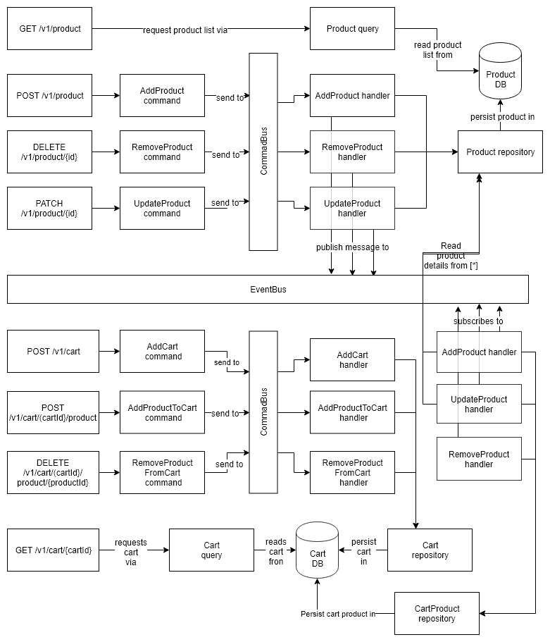

# Sample product / cart API

This is sample REST service that provides simple functionality of product store and shopping
cart. 

## Requirements

Client should be able to:

1. add product to the catalog
1. remove product from the catalog
1. update product name
1. update product price
1. list all products in the catalog as a paginated list with at most 3 products per page
1. create a cart
1. add product to the cart
1. remove product from the cart
1. list all products in the cart
    - cart can contain a max. of 3 products
    - cart should display a total price of all products in it

## Design

Solution is modelled as two "separate" microservices (although for simplicity living in
one PHP application). Product microservice provides REST endpoints that
allows to manipulate product and persist it in database. Cart microservice provides
REST endpoints for manipulating cart and products in cart and persist it in
cart database, separate from product database to allow independent scalability of
both microservices. For the same reason cart database contains copy of relevant
product data (for the sake of availability consistency is exchanged for eventual
consistency).

Data synchronization between two services is conducted via event bus. Modifications
in product database send appropriate events to event bus to which cart microservice
subscribes. In real case scenario event bus would be realized using e.g. RMQ in
this case, again, event bus is modelled directly in PHP. Still the only information
sent via event bus is unique product identifier, the rest of information must
be fetched from product microservice directly. Again, in real world scenario product
microservice would expose REST endpoint and cart microservice would use it to
fetch information about product. For simplicity this project allows cart service
to reuse product repository.



## REST Endpoints Definitions

See raw [swagger file](public/swagger.yaml) or [Swagger UI](http://127.0.0.1:8000/swagger/) (after you
follow "How to run" section). 

## How to run

```bash
# install dependencies
composer install

# make sure tests pass, code is clean 
composer check 

# start built in www server on port 8000
php bin/console server:run
```

Now you can [play with API directly](http://127.0.0.1:8000/v1/product), or via built in
[Swagger UI](http://127.0.0.1:8000/swagger/).

## Libraries / frameworks used:

Software used in project include:

- [Symfony 4](https://symfony.com/4)
- [SimpleBus](http://docs.simplebus.io)
- [Swagger UI](https://swagger.io/tools/swagger-ui/)
- [esky/enum](https://github.com/eskypl/enum)
- [ramsey/uuid](https://github.com/ramsey/uuid)

## License

[MIT](LICENSE)
